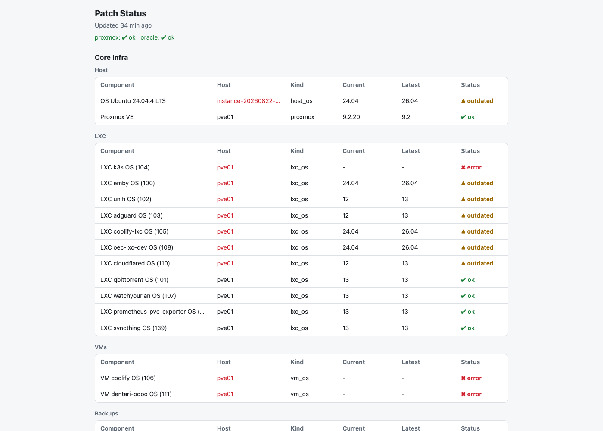
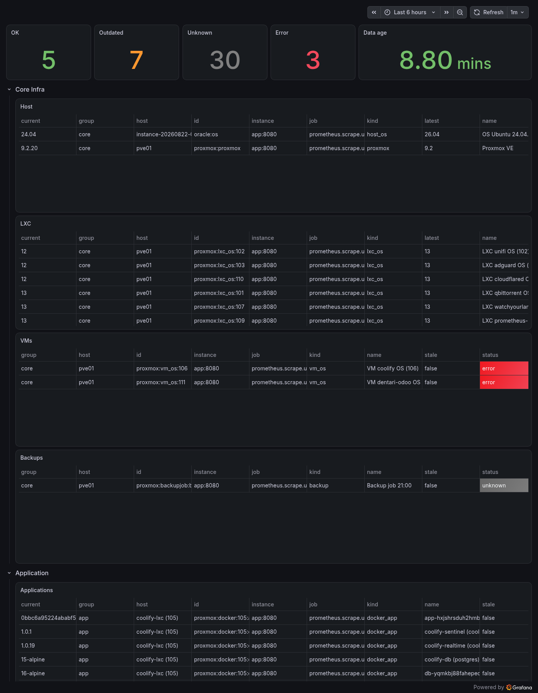

# universal-patch-management

Polls Proxmox/LXC/VM/Docker hosts over SSH, compares installed vs. latest-stable versions, and serves a
status dashboard (`/status.json`, `/healthz`) that feeds a Grafana dashboard via Alloy. One glance shows
which hosts, containers, and backup jobs are up to date and which need attention.

Also feeds a Grafana Cloud dashboard (`upm_component_status`/`upm_generated_timestamp_seconds` metrics via
Alloy), mirroring the same Core Infra / Application grouping:

Dashboard JSON is exported at `docs/grafana-dashboard.json` (source of truth is Grafana Cloud; re-export
after changes there).

## Running

1. `cp .env.example .env` and fill in only the `PVE01_*` values. Never reuse `.env.dev`; it holds unrelated secrets.
2. Place an SSH key at `secrets/id_ed25519` and `chmod 600` it. Create it BEFORE the first `docker compose up`, otherwise Docker creates a root-owned directory at that path.
3. Start: `UPM_UID=$(id -u) docker compose up --build -d`
4. Routed via Traefik labels (Coolify) — no host port is published. The dashboard has no auth, so it must sit behind Traefik/Coolify, not be exposed directly.

Non-pve SSH hosts (OS + docker app + backup checks) are defined in `components.json` under `"hosts"`. Each host has:

- `id` (used as the host label and component id prefix), `user`, `address`
- `docker` (bool, whether to enumerate `docker ps` containers as app components)
- optional `backup_cmd`, a command on the host that prints the last backup time as epoch seconds

Any string value in `components.json` may reference `${VAR_NAME}`, expanded from the process environment at
load time (e.g. `.env`). Use this to keep real IPs/hostnames out of `components.json` — see `ORACLE_SSH_HOST_1`
in `.env.example`.

Probes are defined in `components.json` under `"probes"`. Each probe has:

- `id` (must start with `probe:`), `name`, `kind`, `group` (`core` or `app`), `host` (label)
- `target`: `{"type":"pve_lxc","vmid":N}` or `{"type":"ssh","host":"..","user":".."}`
- `cmd` and `regex` (group 1 = version)
- optional `latest_key`, matching a key under `"sources"`

## Collectors

Three collectors feed `/status.json`, all producing the same component shape (`version_component` /
`error_component` / `backup_component`) and resolving "latest" via `sources`:

| Collector                              | Config                             | Scope                                                                                                        | How it checks                                                                                                                                                                                                                          |
| -------------------------------------- | ---------------------------------- | ------------------------------------------------------------------------------------------------------------ | -------------------------------------------------------------------------------------------------------------------------------------------------------------------------------------------------------------------------------------- |
| `ProxmoxCollector` (`pve.py`)      | always runs (needs`PVE01_*` env) | the Proxmox host itself + every guest on the cluster (LXCs + VMs, auto-discovered via`/cluster/resources`) | Proxmox VE version, backup job status, and each job's actual last run all via the Proxmox HTTP API; per-guest OS + docker`ps` via QEMU guest-agent exec (VMs) or `pct exec` (LXCs)                                                 |
| `SshHostCollector` (`ssh_host.py`) | `"hosts"` list                   | one fixed non-pve host per entry                                                                             | plain SSH:`cat /etc/os-release` for OS, `docker ps` loop if `docker: true`, optional `backup_cmd` — all hardcoded, nothing to configure per-check                                                                             |
| `ProbesCollector` (`probes.py`)    | `"probes"` list                  | whatever you point it at, one probe = one component                                                          | arbitrary`cmd` run over SSH or `pct exec`, version pulled out via `regex` group 1 — escape hatch for anything the other two don't cover (e.g. proxmox-ve version check outside pve.py, a non-docker app, one specific LXC's OS) |

Endpoints: `/status.json` (data) and `/healthz` (liveness).
